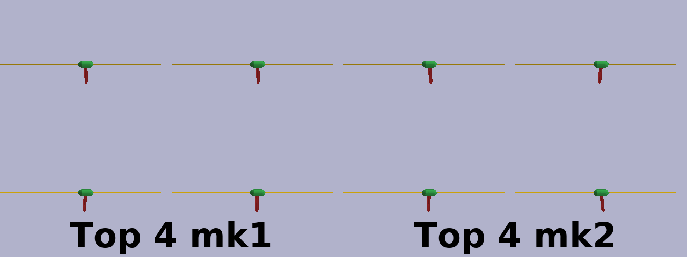
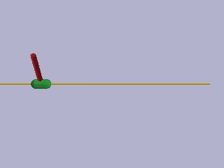
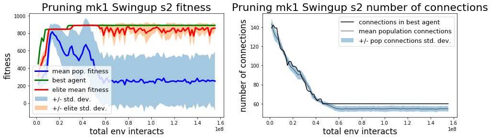
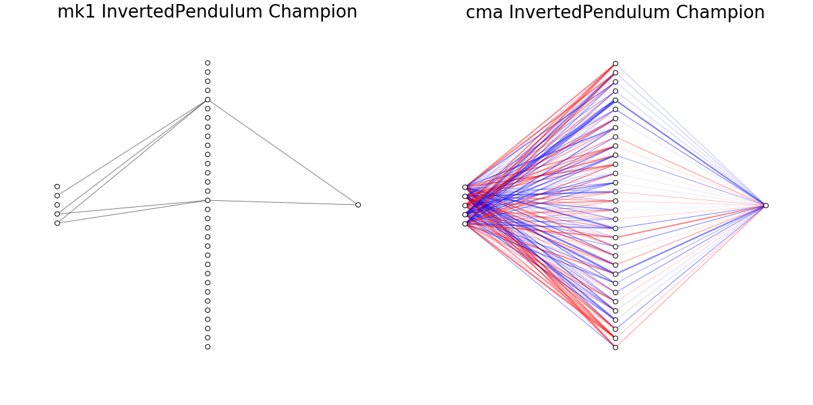

# Synaptolysis: Pruning as a Learning Mechanism
 
## Getting Started

This project is a work in progress, and I encourage you to play with what we have so far and see what you come up with. 


This project has few dependencies, but does need `pybullet` and `gym` for the environments. 

```pip install -r requirements.txt```


The default movement range on `InvertedPendulumSwingupBulletEnv-v0` is pretty short. I trained agents on a slightly modified version with a longer rail by modifying the xml file. If you are using a virtual environment this can probably be found in
`<your_env_path>/lib/python3.6/site-packages/pybullet_data/mjcf/inverted_pendulum.xml`

Change the lines:

```

        <geom name="rail" pos="0 0 0" quat="0.707 0 0.707 0" rgba="0.3 0.3 0.7 1" size="0.02 1" type="capsule"/>
        <body name="cart" pos="0 0 0">
            <joint axis="1 0 0" limited="true" name="slider" pos="0 0 0" range="-1 1" type="slide"/>
```
to
```
        <geom name="rail" pos="-2 0 0" quat="0.707 0 0.707 0" rgba="0.3 0.3 0.7 1" size="0.02 4" type="capsule"/>
        <body name="cart" pos="0 0 0">
            <joint axis="1 0 0" limited="true" name="slider" pos="0 0 0" range="-2 2" type="slide"/>
```

For a little more room. Even with the modified environment I notice that the agents still tend to learn that they can use the stops to their advantage in swinging up the balance pole. 

## Watch a trained agent swing a pole around



```
python src/enjoy.py --env_name InvertedPendulumSwingupBulletEnv-v0 --model models/prune_mk2_5_32_exp003/prunemk2_5241643InvertedPendulumSwingupBulletEnv-v0_s2_gen100.npy_
# or
python src/enjoy.py -m models/prune_mk1_32_exp003/prunemk1_5191527InvertedPendulumSwingupBulletEnv-v0_s2_gen100.npy
# or
python src/enjoy.py --env_name InvertedPendulumSwingupBulletEnv-v0 --model models/cma_32_exp003/cma_5287031InvertedPendulumSwingupBulletEnv-v0_s2_gen100.npy
```


<p align="center">examples of simple policy networks learned for the `InvertedPendulumSwingup` environment</p>
